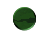



## FormShape Editor and OCX

### Description

You can edit the shape of your forms using mouse or images. The OCX attached makes the effect visible in design and runtime mode.
 
### More Info
 
This code is not 100% mine. The original code is called ANYSHAPE.ZIP, but unfortunately I don't remember

who the author is. If you recognize your code please e-mail me so I can give the credit for your work.

Original features:

- drawing shapes using mouse

New features added:

- drawing shapes from image

- saving/loading shapes in/from txt files

- animated shapes

- combined shapes

- an OCX that loads shapes from txt files even at design time

             |
---                |---
**Submitted On**   |2000-02-26 21:05:04
**By**             |[Florin Florea](https://github.com/Planet-Source-Code/PSCIndex/blob/master/ByAuthor/florin-florea.md)
**Level**          |Advanced
**User Rating**    |5.0 (15 globes from 3 users)
**Compatibility**  |VB 5\.0, VB 6\.0
**Category**       |[Custom Controls/ Forms/  Menus](https://github.com/Planet-Source-Code/PSCIndex/blob/master/ByCategory/custom-controls-forms-menus__1-4.md)
**World**          |[Visual Basic](https://github.com/Planet-Source-Code/PSCIndex/blob/master/ByWorld/visual-basic.md)
**Archive File**   |[CODE\_UPLOAD3699312000\.zip](https://github.com/Planet-Source-Code/florin-florea-formshape-editor-and-ocx__1-6276/archive/master.zip)

